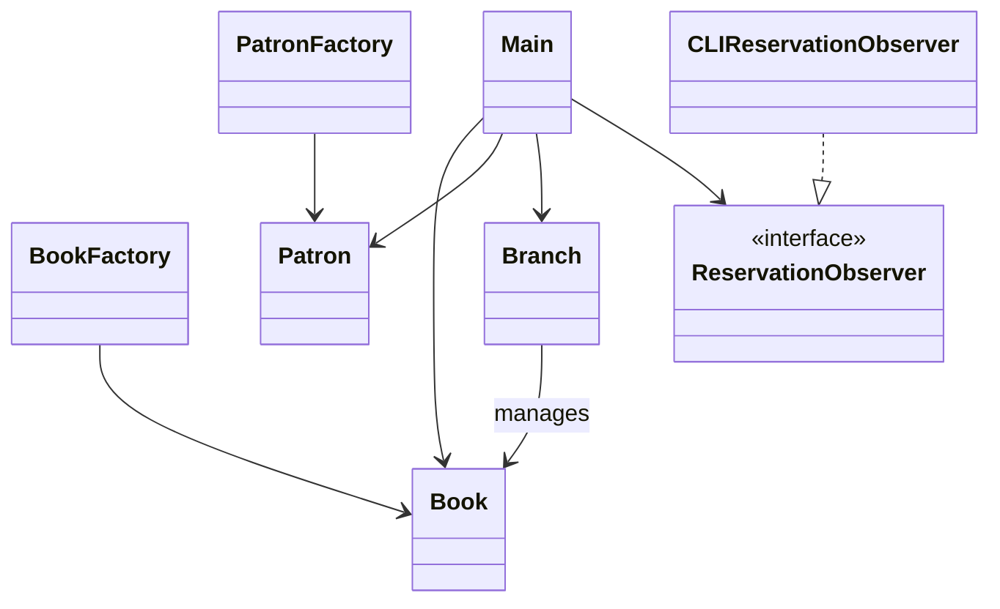

# Library Management System

## Overview
This is a simple Library Management System implemented in Java. It allows users to manage books, patrons, and library branches via a command-line interface (CLI). Features include adding, removing, updating, searching, borrowing, returning, reserving, and transferring books, as well as managing patrons and branches.

## Features
- List, add, remove, update, and search books
- List, add, and update patrons
- Borrow and return books
- Reserve books and manage reservation queues
- List branches and transfer books between branches
- Book recommendations based on borrowing history

## Project Structure
```
src/
  Main.java
  library/
    Book.java
    BookFactory.java
    Branch.java
    CLIReservationObserver.java
    Patron.java
    PatronFactory.java
    ReservationObserver.java
```

## How to Run
1. Compile the project:
   ```
   javac -d out src/Main.java src/library/*.java
   ```
2. Run the program:
   ```
   java -cp out Main
   ```

## Class Diagram




